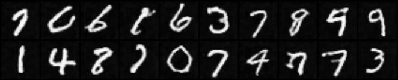
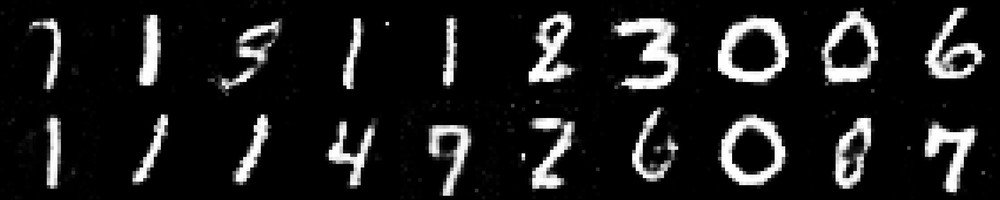
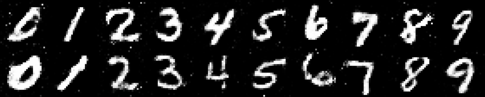

:author: Lukas Turcani

.. image::

This repo provides a number of network architectures, implemented in
both PyTorch and TensorFlow as well as scripts used to run them.

To train a network, run the appropriate run script. For example::

    $ python -m dnn.pytorch.train_scripts.mnist.progressive_growing_gan

or::

    $ python -m dnn.tensorflow.train_scripts.cifar100.simple_cnn

Notice that the scripts are run from the module level using the
``python -m`` flag.

Networks can be modified using command line arguments, for example::

    $ python -m dnn.pytorch.train_scripts.mnist.simple_cnn --conv_in_channels 1 20 50 --conv_out_channels 20 50 60 --conv_kernel_size 5 5 5 --conv_strides 1 1 1 --conv_paddings 0 0 0 --conv_dilations 1 1 1 --pool_kernel_sizes 2 2 2 --pool_strides 2 2 2 --pool_paddings 0 0 0 --pool-dilations 1 1 1 --train_batch_size 100 --label_smoothing 0.5 --epochs 10

changes the default values for training batch size, label smoothing and
the number of training epochs and adds a new convoluation layer and pooling
layer vs the default network. Any number of layers can be added / removed
via the command line in this fashion.

Each script can have options view by::

    $ python -m path.to.train.script --help

Results
=======

This is a short summary of some of the nice results from this repo.
Not all implemented architectures are listed here.

* `Progressive Growing GAN (PGGAN)`_
* `Image Inpainting`_
* `DCGAN`_
* `FCGAN`_

Progressive Growing GAN (PGGAN)
-------------------------------

This is a somewhat complex GAN, largely due to a unqiue training
procedure where the resolution of the GAN is slowly increased during
training. This is simple to implement in PyTorch and I have no
intention of attempting this in TensorFlow.

Run with::

    $ python -m dnn.pytorch.train_scripts.mnist.progressive_growing_gan

Results:

    .. image:: images/pytorch/pggan.gif

Image Inpainting
----------------

This is a task where the generator is provided with an image that
is missing some pixels and it is asked to fill them in. In this
example, I cover up the bottom half of MNIST images and get the
generator to fill them in.

PyTorch implentation
....................

Coming up.

TensorFlow implementation
.........................

Run with::

    $ python -m dnn.tensorflow.train_scripts.mnist.image_inpainting

Results:

.. image::

DCGAN
-----

A more advanced GAN architecture, which is fully convolutional.

PyTorch implementation
......................

Run with::

    $ python -m dnn.pytorch.train_scripts.mnist.dcgan

.. image::

TensorFlow implentation
.......................

Run with::

    $ python -m dnn.tensorflow.train_scripts.mnist.dcgan

To generate results::

    $ python -m dnn.tensorflow.train_scripts.mnist.dcgan --sample_generator

This network can also be trained using the labelling information
present in the MNIST dataset. This leads to better results and each
digit can be sampled explicitly.

Run with::

    $ python -m dnn.tensorflow.train_scripts.mnist.dcgan --labels

To generate results::

    $ python -m dnn.tensorflow.train_scripts.mnist.dcgan --labels --sample_generator

.. image:: images/tensorflow/mnist_dcgan_labels.jpg

FCGAN
-----

This is a vanilla GAN using feed-forward networks as both the
generator and disriminator.

PyTorch implementation
.......................

Run with::

    $ python -m dnn.pytorch.train_scripts.mnist.fcgan

Results:

.. image::

TensorFlow implementation
..........................

Run with::

    $ python -m dnn.tensorflow.train_scripts.mnist.fcgan

To generate results::

    $ python -m dnn.tensorflow.train_scripts.mnist.fcgan --sample_generator

This network can also be trained using the labelling information
present in the MNIST dataset. This leads to better results and each
digit can be sampled explicitly.

Run with::

    $ python -m dnn.tensorflow.train_scripts.mnist.dcgan --labels

To generate results::

    $ python -m dnn.tensorflow.train_scripts.mnist.dcgan --labels --sample_generator

